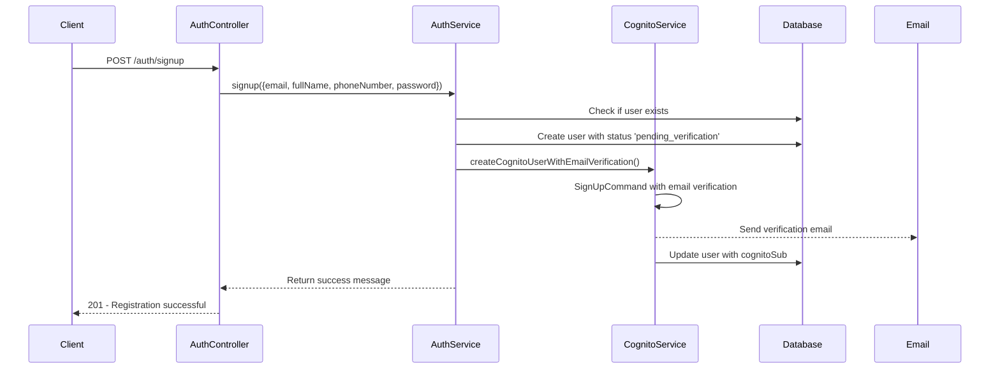
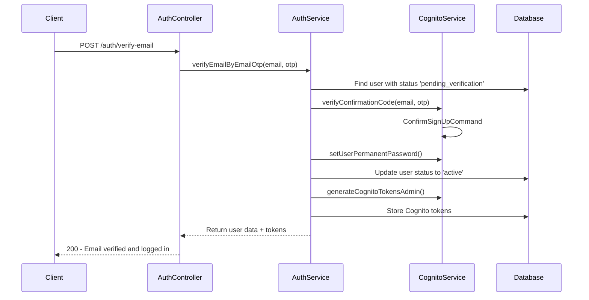
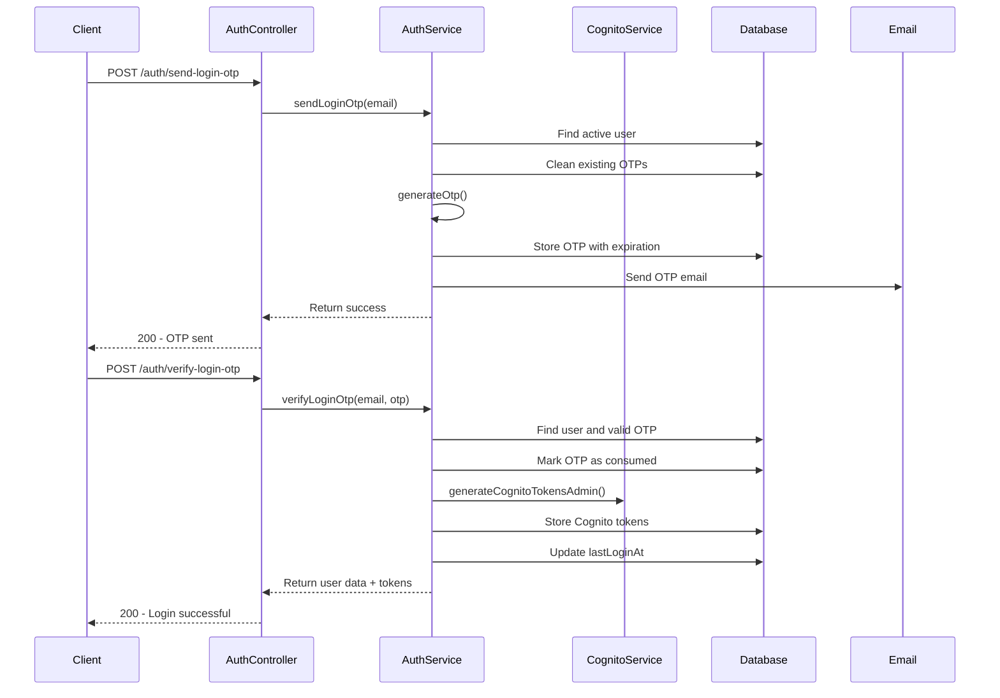
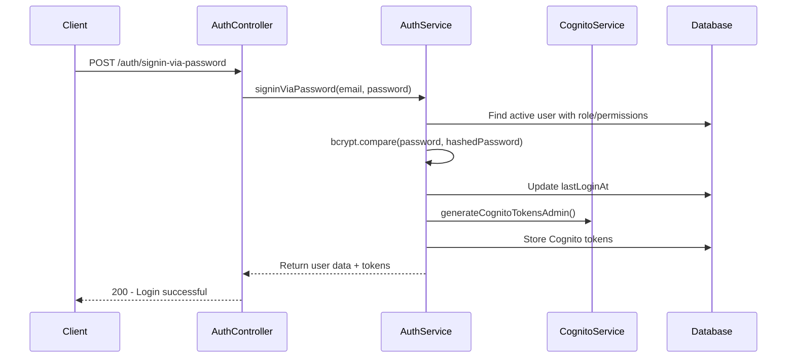
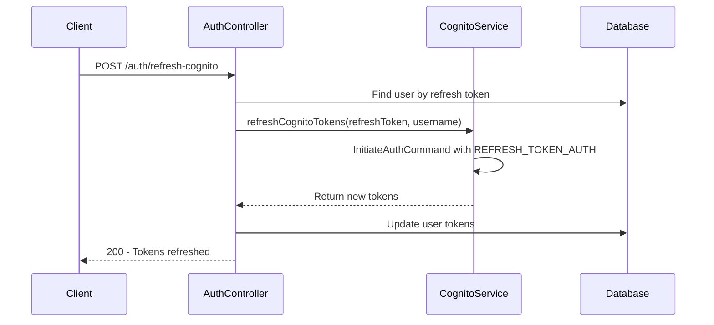
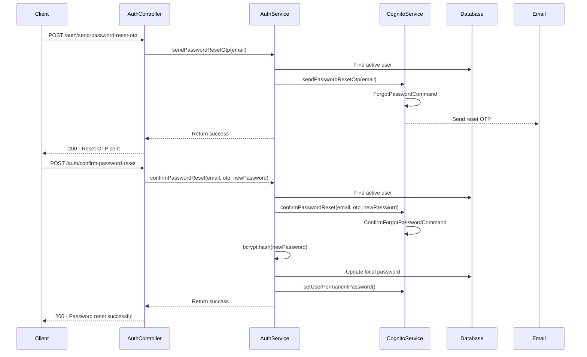

# Authentication Flow Documentation

## Overview

This application implements a comprehensive authentication system using AWS Cognito for user management and token-based authentication. The system supports multiple authentication methods including email verification, OTP-based login, and password-based authentication.

## Architecture Components

### 1. Core Services
- **AuthService** (`services/auth.service.js`) - Main authentication business logic
- **CognitoAuthService** (`services/cognito.service.js`) - AWS Cognito integration
- **AuthController** (`controllers/auth.controller.js`) - HTTP request handlers
- **AuthMiddleware** (`middlewares/auth.middleware.js`) - Authentication and authorization middleware

### 2. Database Models
- **User** (`models/user.model.js`) - User data and Cognito integration
- **LoginOtp** (`models/login_otp.model.js`) - OTP storage for custom login flow
- **Role** (`models/role.model.js`) - User roles and permissions
- **RolePermission** (`models/role_permission.model.js`) - Permission definitions

### 3. Validation
- **AuthValidator** (`middlewares/validators/auth.validator.js`) - Input validation for auth endpoints

## Authentication Routes

### Public Routes (No Authentication Required)

| Route | Method | Description | Validation |
|-------|--------|-------------|------------|
| `/auth/signup` | POST | User registration with email verification | `validateSignup` |
| `/auth/verify-email` | POST | Email verification with OTP | `validateVerifyEmail` |
| `/auth/resend-confirmation-code` | POST | Resend email verification code | Email validation |
| `/auth/send-login-otp` | POST | Send OTP for login | `validateSendLoginOtp` |
| `/auth/verify-login-otp` | POST | Verify OTP and login | `validateVerifyLoginOtp` |
| `/auth/signin-via-password` | POST | Password-based login | `validateSigninViaPassword` |
| `/auth/refresh-cognito` | POST | Refresh Cognito tokens | `validateRefreshCognito` |
| `/auth/send-password-reset-otp` | POST | Send password reset OTP | `validateSendPasswordResetOtp` |
| `/auth/confirm-password-reset` | POST | Confirm password reset | `validatePasswordReset` |

## Database Schema

### Users Table
```sql
CREATE TABLE users (
    id BIGINT PRIMARY KEY AUTO_INCREMENT,
    email VARCHAR(255) UNIQUE NOT NULL,
    full_name VARCHAR(200) NOT NULL,
    phone_number VARCHAR(20) UNIQUE,
    is_kyc_verified BOOLEAN DEFAULT FALSE,
    status ENUM('active', 'inactive', 'suspended', 'pending_verification') DEFAULT 'pending_verification',
    email_verified_at DATETIME,
    last_login_at DATETIME,
    role_id BIGINT NOT NULL,
    cognito_sub VARCHAR(255) UNIQUE,
    cognito_username VARCHAR(255),
    cognito_service_password VARCHAR(255),
    cognito_tokens JSON,
    password VARCHAR(255),
    created_at DATETIME DEFAULT CURRENT_TIMESTAMP,
    updated_at DATETIME DEFAULT CURRENT_TIMESTAMP ON UPDATE CURRENT_TIMESTAMP
);
```

### Login OTPs Table
```sql
CREATE TABLE login_otps (
    id BIGINT PRIMARY KEY AUTO_INCREMENT,
    email VARCHAR(255) NOT NULL,
    otp VARCHAR(6) NOT NULL,
    otp_expires_at DATETIME NOT NULL,
    session TEXT,
    consumed_at DATETIME,
    created_at DATETIME DEFAULT CURRENT_TIMESTAMP
);
```

### Roles Table
```sql
CREATE TABLE roles (
    id BIGINT PRIMARY KEY AUTO_INCREMENT,
    name VARCHAR(50) UNIQUE NOT NULL,
    type ENUM('admin', 'moderator', 'user', 'kyc_reviewer', 'super_admin') NOT NULL,
    description TEXT,
    is_active BOOLEAN DEFAULT TRUE,
    created_at DATETIME DEFAULT CURRENT_TIMESTAMP,
    updated_at DATETIME DEFAULT CURRENT_TIMESTAMP ON UPDATE CURRENT_TIMESTAMP
);
```

## Authentication Flows

### 1. User Registration Flow



**Key Functions Called:**
- `AuthService.signup()` - Main registration logic
- `CognitoAuthService.createCognitoUserWithEmailVerification()` - Creates Cognito user
- `User.create()` - Creates local user record
- `User.update()` - Updates with Cognito information

**Fields Stored:**
- Local database: `email`, `fullName`, `phoneNumber`, `password` (hashed), `roleId`, `status: 'pending_verification'`
- Cognito: User attributes, temporary password, email verification status

### 2. Email Verification Flow



**Key Functions Called:**
- `AuthService.verifyEmailByEmailOtp()` - Email verification logic
- `CognitoAuthService.verifyConfirmationCode()` - Verifies Cognito confirmation code
- `CognitoAuthService.setUserPermanentPassword()` - Sets service password
- `CognitoAuthService.generateCognitoTokensAdmin()` - Generates authentication tokens
- `User.updateCognitoTokens()` - Stores tokens in database

**Fields Updated:**
- `status: 'active'`
- `emailVerifiedAt: current_timestamp`
- `lastLoginAt: current_timestamp`
- `cognitoTokens: {accessToken, idToken, refreshToken, tokenType, expiresIn}`

### 3. OTP Login Flow



**Key Functions Called:**
- `AuthService.sendLoginOtp()` - Generates and sends OTP
- `AuthService.generateOtp()` - Creates 6-digit OTP
- `LoginOtp.create()` - Stores OTP in database
- `Email.sendLoginOtpEmail()` - Sends OTP via email
- `AuthService.verifyLoginOtp()` - Verifies OTP and logs in user
- `LoginOtp.update()` - Marks OTP as consumed

**Fields Stored:**
- `login_otps`: `email`, `otp`, `otpExpiresAt`, `consumedAt`
- `users`: `lastLoginAt`, `cognitoTokens`

### 4. Password Login Flow



**Key Functions Called:**
- `AuthService.signinViaPassword()` - Password authentication logic
- `bcrypt.compare()` - Verifies password hash
- `CognitoAuthService.generateCognitoTokensAdmin()` - Generates tokens
- `User.updateCognitoTokens()` - Stores tokens

### 5. Token Refresh Flow



**Key Functions Called:**
- `CognitoAuthService.refreshCognitoTokens()` - Refreshes Cognito tokens
- `User.updateCognitoTokens()` - Updates stored tokens

### 6. Password Reset Flow



**Key Functions Called:**
- `AuthService.sendPasswordResetOtp()` - Initiates password reset
- `CognitoAuthService.sendPasswordResetOtp()` - Sends Cognito reset OTP
- `AuthService.confirmPasswordReset()` - Confirms password reset
- `CognitoAuthService.confirmPasswordReset()` - Confirms with Cognito
- `bcrypt.hash()` - Hashes new password for local storage

## Cognito Integration

### Environment Variables Required
```env
AWS_REGION=us-east-1
AWS_ACCESS_KEY_ID=your_access_key
AWS_SECRET_ACCESS_KEY=your_secret_key
COGNITO_USER_POOL_ID=your_user_pool_id
COGNITO_CLIENT_ID=your_client_id
COGNITO_CLIENT_SECRET=your_client_secret (optional)
JWT_SECRET=your_jwt_secret
```

### Cognito User Pool Configuration
- **Username Configuration**: Email as username
- **Password Policy**: Minimum 8 characters with complexity requirements
- **MFA**: Optional (can be enabled for additional security)
- **Email Verification**: Required for new signups
- **User Attributes**: email, name, phone_number

### Cognito Commands Used
- `SignUpCommand` - User registration with email verification
- `ConfirmSignUpCommand` - Email verification
- `AdminCreateUserCommand` - Admin-created users
- `AdminSetUserPasswordCommand` - Set permanent passwords
- `AdminInitiateAuthCommand` - Generate tokens (ADMIN_NO_SRP_AUTH flow)
- `InitiateAuthCommand` - Token refresh (REFRESH_TOKEN_AUTH flow)
- `ForgotPasswordCommand` - Password reset initiation
- `ConfirmForgotPasswordCommand` - Password reset confirmation
- `ResendConfirmationCodeCommand` - Resend verification codes

## Authentication Middleware

### Available Middleware Functions

| Middleware | Description | Usage |
|------------|-------------|-------|
| `authenticate` | Verifies Cognito access token | Required for protected routes |
| `requirePermission(resource, action)` | Checks specific permission | Role-based access control |
| `requireAnyPermission(permissions)` | Checks any of multiple permissions | Flexible permission checking |
| `requireAllPermissions(permissions)` | Checks all specified permissions | Strict permission requirements |
| `requireRole(roles)` | Checks user role | Role-based access |
| `requireOwnership(userIdParam)` | Ensures user owns resource | Resource ownership validation |
| `optionalAuth` | Optional authentication | Public routes with user context |
| `requireKycVerified` | Requires KYC verification | KYC-protected endpoints |

### Token Verification Process
1. Extract Bearer token from Authorization header
2. Verify token with Cognito JWT verifier
3. Extract user identifier from token payload
4. Find user in database by cognitoSub, cognitoUsername, or email
5. Load user with role and permissions
6. Attach user to request object

## Security Features

### Password Security
- **Hashing**: bcrypt with salt rounds of 12
- **Requirements**: Minimum 8 characters, uppercase, lowercase, number, special character
- **Storage**: Hashed passwords stored locally, service passwords in Cognito

### Token Security
- **Access Tokens**: Short-lived (typically 1 hour)
- **Refresh Tokens**: Long-lived (typically 30 days)
- **Storage**: Tokens stored in database JSON field
- **Verification**: JWT verification with Cognito public keys

### OTP Security
- **Generation**: 6-digit random numeric OTP
- **Expiration**: 30 minutes
- **Single Use**: OTPs are marked as consumed after use
- **Cleanup**: Old OTPs are automatically cleaned up

### Rate Limiting
- Cognito provides built-in rate limiting
- Custom rate limiting can be added at middleware level
- OTP generation has built-in cooldown periods

## Error Handling

### Common Error Types
- **Validation Errors**: Input validation failures (400)
- **Authentication Errors**: Invalid tokens, expired tokens (401)
- **Authorization Errors**: Insufficient permissions (403)
- **Not Found Errors**: User not found, invalid OTP (404)
- **Rate Limit Errors**: Too many requests (429)
- **Server Errors**: Cognito service issues (500)

### Error Response Format
```json
{
  "success": false,
  "message": "Error description",
  "error": {
    "field": "field_name",
    "code": "ERROR_CODE",
    "validationErrors": []
  }
}
```

## User States and Transitions

### User Status Flow
```
pending_verification → active → inactive/suspended
```

### Status Definitions
- **pending_verification**: New user, email not verified
- **active**: Email verified, can login
- **inactive**: Temporarily disabled
- **suspended**: Permanently disabled

## Role-Based Access Control

### Default Roles
- **super_admin**: Full system access
- **admin**: Administrative access
- **moderator**: Content moderation
- **kyc_reviewer**: KYC verification
- **user**: Regular user (default)

### Permission System
- **Resource-based**: Permissions tied to specific resources
- **Action-based**: Permissions for specific actions (create, read, update, delete)
- **Hierarchical**: Super admin bypasses all permission checks

## API Response Format

### Success Response
```json
{
  "success": true,
  "message": "Operation successful",
  "data": {
    "user": {
      "id": 1,
      "email": "user@example.com",
      "fullName": "John Doe",
      "role": {
        "id": 3,
        "name": "Regular User",
        "type": "user"
      },
      "permissions": []
    },
    "cognitoTokens": {
      "accessToken": "eyJ...",
      "idToken": "eyJ...",
      "refreshToken": "eyJ...",
      "tokenType": "Bearer",
      "expiresIn": 3600
    }
  }
}
```

### Error Response
```json
{
  "success": false,
  "message": "Error description",
  "error": {
    "field": "email",
    "code": "VALIDATION_ERROR"
  }
}
```

## Testing

### Test Files
- `__tests__/auth.controller.test.js` - Controller tests
- Authentication flow integration tests

### Test Scenarios
- User registration and email verification
- OTP generation and verification
- Password-based authentication
- Token refresh
- Password reset flow
- Permission-based access control
- Error handling and validation

## Deployment Considerations

### Environment Setup
1. Configure AWS Cognito User Pool
2. Set up environment variables
3. Configure email service (SES or similar)
4. Set up database with proper indexes
5. Configure CORS for frontend integration

### Monitoring
- Monitor Cognito API usage and limits
- Track authentication success/failure rates
- Monitor token refresh patterns
- Log security events and anomalies

### Scaling
- Cognito handles user scaling automatically
- Database indexes on frequently queried fields
- Consider Redis for session storage in high-traffic scenarios
- Implement proper caching for user permissions

## Troubleshooting

### Common Issues
1. **Cognito Configuration**: Verify environment variables and user pool settings
2. **Token Verification**: Check JWT verifier configuration and token format
3. **Email Delivery**: Verify SES configuration and email templates
4. **Database Connections**: Ensure proper database connectivity and indexes
5. **Permission Issues**: Verify role assignments and permission configurations

### Debug Logging
- Enable detailed logging for authentication flows
- Log Cognito API responses and errors
- Track user state transitions
- Monitor token generation and verification

This documentation provides a comprehensive overview of the authentication system, including all routes, database schemas, authentication flows, and security considerations.
