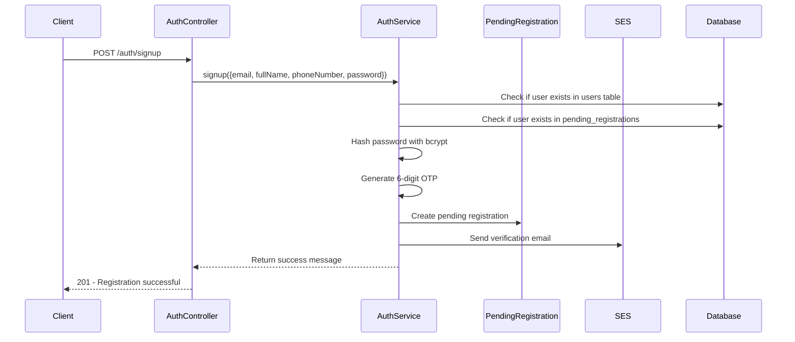
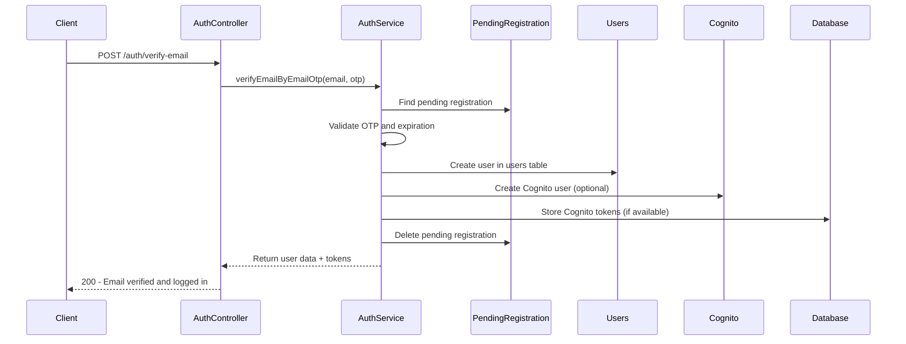
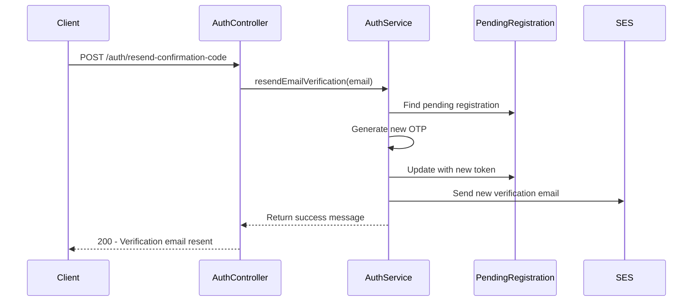

# Pending Registration Flow Documentation

## Overview

This document describes the new authentication flow that uses a separate `pending_registrations` table to store unverified user data before creating Cognito users. This approach provides better control over the registration process and reduces unnecessary Cognito user creation.

## Benefits of the New Flow

1. **Cost Optimization**: No Cognito users created until email verification
2. **Better Data Integrity**: Only verified users exist in Cognito
3. **Cleaner Separation**: Clear distinction between pending and active users
4. **Easier Cleanup**: Simple removal of unverified registrations
5. **SES Integration**: Uses SES for email verification instead of Cognito's built-in email service

## Database Schema

### Pending Registrations Table

```sql
CREATE TABLE pending_registrations (
    id BIGSERIAL PRIMARY KEY,
    email VARCHAR(255) UNIQUE NOT NULL,
    full_name VARCHAR(200) NOT NULL,
    phone_number VARCHAR(20),
    password VARCHAR(255) NOT NULL,
    role_id BIGINT NOT NULL DEFAULT 3,
    verification_token VARCHAR(6) NOT NULL,
    verification_expires_at TIMESTAMP NOT NULL,
    verification_attempts INTEGER NOT NULL DEFAULT 0,
    last_verification_attempt TIMESTAMP,
    created_at TIMESTAMP DEFAULT CURRENT_TIMESTAMP,
    updated_at TIMESTAMP DEFAULT CURRENT_TIMESTAMP,
    
    CONSTRAINT fk_pending_registrations_role_id 
      FOREIGN KEY (role_id) REFERENCES roles(id) ON DELETE RESTRICT
);
```

### Indexes

```sql
CREATE INDEX idx_pending_registrations_email ON pending_registrations(email);
CREATE INDEX idx_pending_registrations_verification_token ON pending_registrations(verification_token);
CREATE INDEX idx_pending_registrations_verification_expires_at ON pending_registrations(verification_expires_at);
CREATE INDEX idx_pending_registrations_created_at ON pending_registrations(created_at);
```

## Authentication Flow

### 1. User Registration Flow



**Key Changes:**
- No immediate Cognito user creation
- Data stored in `pending_registrations` table
- Verification token generated locally
- Email sent via SES

### 2. Email Verification Flow



**Key Changes:**
- OTP verification happens locally
- User created in `users` table only after verification
- Cognito user creation is optional (graceful fallback)
- Pending registration is cleaned up after successful verification

### 3. Resend Verification Flow



## API Endpoints

### Registration Endpoints

| Endpoint | Method | Description | Changes |
|----------|--------|-------------|---------|
| `/auth/signup` | POST | User registration | ✅ Uses pending_registrations table |
| `/auth/verify-email` | POST | Email verification | ✅ Verifies local OTP, creates user |
| `/auth/resend-confirmation-code` | POST | Resend verification | ✅ Generates new local OTP |

### Login Endpoints (Unchanged)

| Endpoint | Method | Description | Status |
|----------|--------|-------------|---------|
| `/auth/send-login-otp` | POST | Send login OTP | ✅ Works with verified users |
| `/auth/verify-login-otp` | POST | Verify login OTP | ✅ Works with verified users |
| `/auth/signin-via-password` | POST | Password login | ✅ Works with verified users |

## Environment Variables

### Required for SES Integration

```env
# AWS Configuration
AWS_REGION=your-region
AWS_ACCESS_KEY_ID=your-access-key
AWS_SECRET_ACCESS_KEY=your-secret-key

# Email Configuration
FROM_EMAIL=your-verified-email@domain.com
APP_NAME=YourAppName

# Cognito Configuration (Optional)
COGNITO_USER_POOL_ID=your-user-pool-id
COGNITO_CLIENT_ID=your-client-id
COGNITO_CLIENT_SECRET=your-client-secret
```

## Security Features

### OTP Security
- **Generation**: 6-digit random numeric OTP
- **Expiration**: 24 hours for registration, 30 minutes for login
- **Attempts**: Maximum 3 verification attempts
- **Single Use**: OTPs are consumed after successful verification

### Password Security
- **Hashing**: bcrypt with salt rounds of 12
- **Storage**: Hashed passwords stored in pending_registrations and users tables
- **Requirements**: Minimum 8 characters with complexity requirements

### Data Cleanup
- **Automatic Cleanup**: Expired pending registrations are automatically removed
- **Manual Cleanup**: Script available for manual cleanup
- **Graceful Degradation**: System works even if Cognito is unavailable

## Error Handling

### Common Error Scenarios

1. **Registration Already in Progress**
   ```json
   {
     "success": false,
     "message": "Registration already in progress. Please check your email for verification code."
   }
   ```

2. **Verification Token Expired**
   ```json
   {
     "success": false,
     "message": "Verification token has expired. Please register again."
   }
   ```

3. **Too Many Verification Attempts**
   ```json
   {
     "success": false,
     "message": "Too many verification attempts. Please register again."
   }
   ```

4. **Invalid Verification Code**
   ```json
   {
     "success": false,
     "message": "Invalid verification code. Please check your email and try again."
   }
   ```

## Migration Guide

### 1. Create the Pending Registrations Table

```bash
npm run migrate:pending-registrations
```

### 2. Update Environment Variables

Ensure your `.env` file includes the required SES configuration:

```env
AWS_REGION=your-region
AWS_ACCESS_KEY_ID=your-access-key
AWS_SECRET_ACCESS_KEY=your-secret-key
FROM_EMAIL=your-verified-email@domain.com
APP_NAME=YourAppName
```

### 3. Verify SES Configuration

Make sure your SES is configured and the `FROM_EMAIL` is verified in your AWS SES console.

### 4. Test the New Flow

1. Register a new user
2. Check email for verification code
3. Verify email with the code
4. Test login functionality

## Maintenance

### Cleanup Expired Registrations

Run the cleanup script periodically:

```bash
# Manual cleanup
npm run cleanup:pending-registrations

# Or add to crontab for daily cleanup at 2 AM
0 2 * * * cd /path/to/project && npm run cleanup:pending-registrations
```

### Monitoring

Monitor the following metrics:
- Number of pending registrations
- Verification success rate
- Email delivery success rate
- Cleanup script execution

## Troubleshooting

### Common Issues

1. **SES Email Not Sending**
   - Verify SES configuration
   - Check if FROM_EMAIL is verified
   - Ensure AWS credentials are correct

2. **Cognito User Creation Failing**
   - System gracefully falls back to password-only authentication
   - Check Cognito configuration
   - Verify user pool settings

3. **Database Connection Issues**
   - Check database connectivity
   - Verify table creation
   - Check foreign key constraints

### Debug Logging

The system provides detailed logging for:
- Email sending attempts
- OTP generation and verification
- Database operations
- Cognito integration
- Cleanup operations

## Benefits Summary

✅ **Cost Effective**: No unnecessary Cognito users  
✅ **SES Integration**: Full control over email delivery  
✅ **Better UX**: Clearer error messages and flow  
✅ **Data Integrity**: Only verified users in production  
✅ **Easy Cleanup**: Simple maintenance and monitoring  
✅ **Graceful Fallback**: Works even without Cognito  

This new flow provides a more robust, cost-effective, and maintainable authentication system while maintaining all existing functionality.
